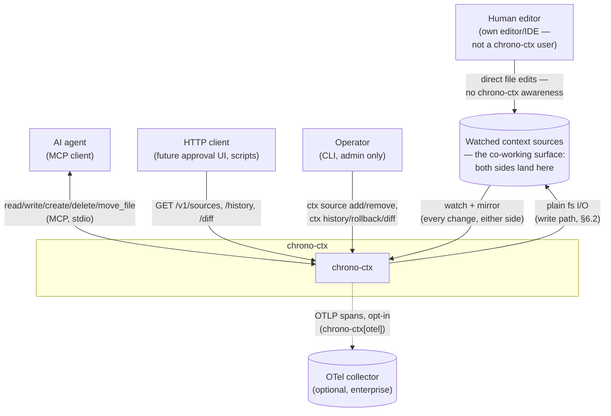
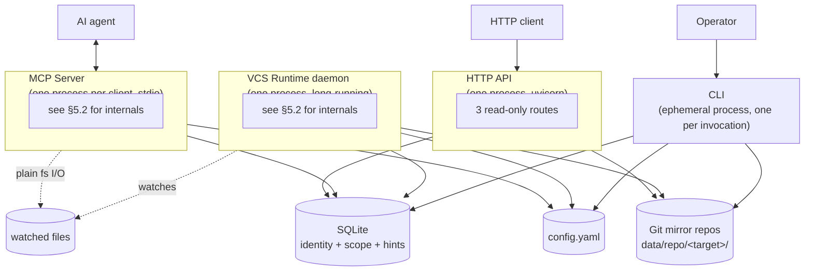
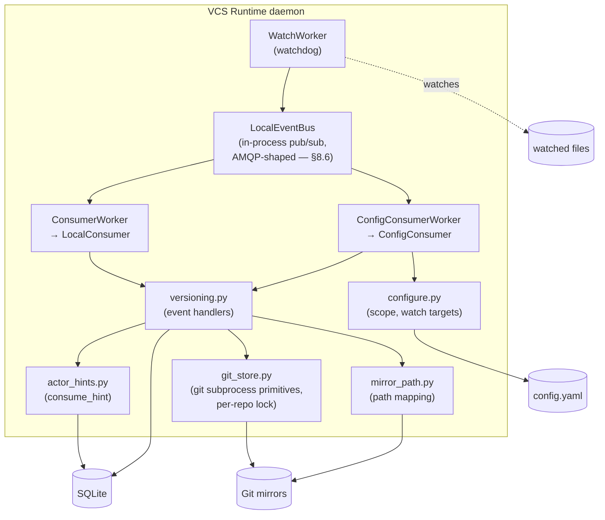
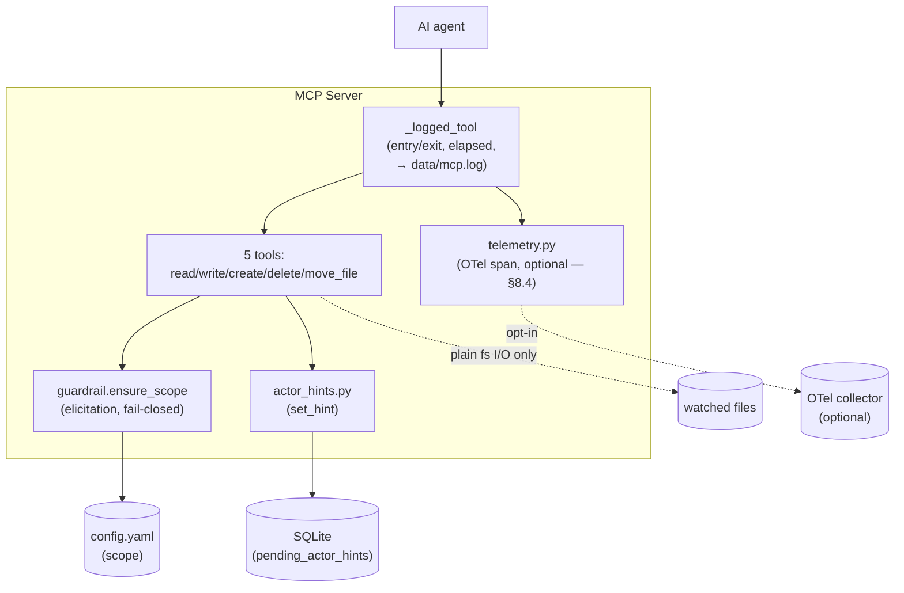
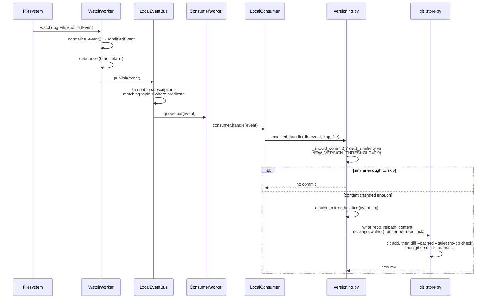
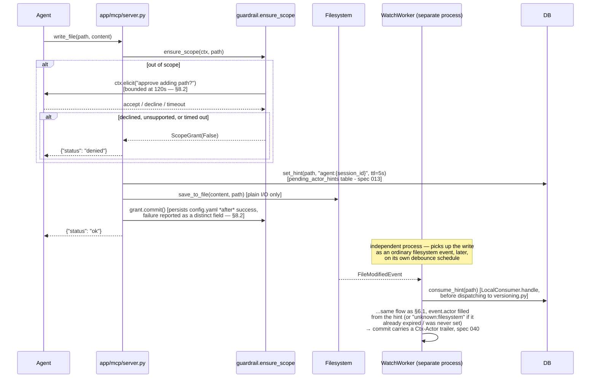
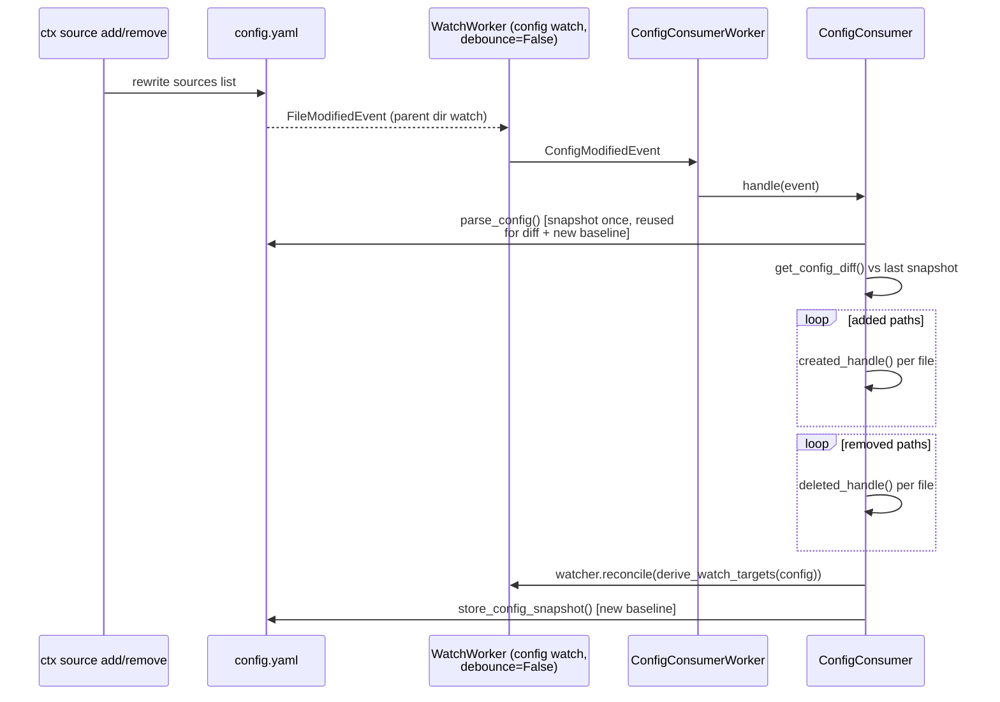
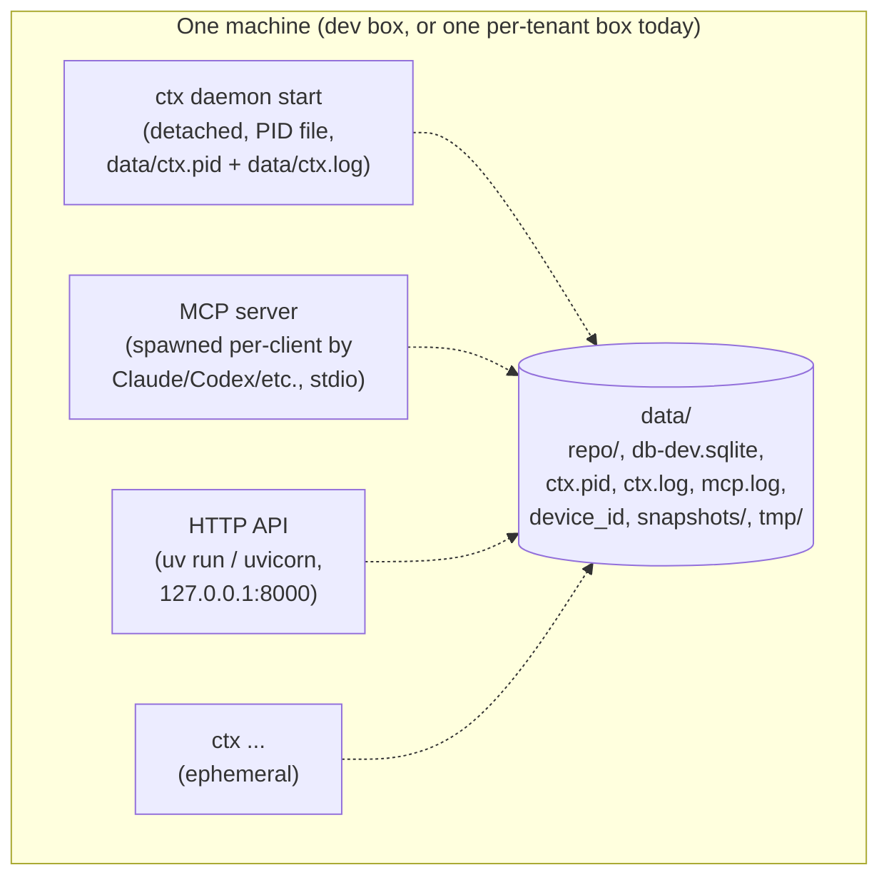

# Architecture

## 1. Introduction and Goals

### 1.1 Requirements overview

**chrono-ctx** versions the *context sources* an AI agent reads from (docs,
prompts, workflows) — not by making the source directory itself a git repo,
but by mirroring watched content into a separate git repository per watch
target and auto committing on every observed change. The same file is
routinely edited by both a human in their own editor and an AI agent over
MCP, neither aware of the other; chrono-ctx exists to make that joint,
unsynchronized editing attributable and recoverable rather than silent.
Three surfaces read/write that state: a filesystem watcher daemon
(always-on), an MCP tool server (for an agent), and a read-only HTTP API.

The problem this solves, concretely:

- Context fed to an agent changes constantly and nothing tracks its
  version — the agent can read a stale or corrupted copy with no way to
  roll back or tell who changed what and when.
- Turning the source directory itself into a git repo doesn't fit: the
  people and agents actually editing these files can't be expected to know
  git, let alone remember to run `git add`/`git commit` after every edit —
  versioning that depends on a human (or an agent) manually operating git
  is versioning that silently stops the moment they forget, which is most
  of the time. On top of that, sources live scattered across many places.
- There's no standard lookup surface — for an agent (MCP) or for another
  system (HTTP) — to ask "what changed in this file, when, by whom" without
  importing the codebase directly.

### 1.2 Quality goals

Ranked — each is a real design trade-off made somewhere in this document,
not an aspiration:

1. **Auditability** — every version is attributable to an actor and
   diffable against any prior version, without trusting the agent that made
   the edit to have reported itself honestly at the content layer (git
   history is independent of what the writer claims).
2. **Fail-fast over fail-silent** — a stuck call must surface a bounded,
   structured error rather than hang or silently lose data (§8.2).
3. **Least privilege** — a watch target's mirror repo, and an MCP agent's
   granted scope, should both be as narrow as what was actually asked for,
   not "everything, because it was easier to implement."

### 1.3 Stakeholders

| Role | Concern |
| --- | --- |
| AI agent (MCP client) | Read/write context sources; know the current version; be stopped by a scope guardrail rather than silently allowed anywhere. |
| **Human editor (direct filesystem)** | Edits the same context sources in their own tools (editor, IDE, file manager) — **not a chrono-ctx user in any active sense**; has run no `ctx` command and may not know it's installed. The other half of the co-working scenario in §1.1, and the reason the watcher exists independently of any chrono-ctx surface. |
| Developer/operator (CLI + daemon) | Declare which sources to track; run the watch daemon; roll back a bad edit, by path or by actor-session. Administrative — no CLI command writes content through the watcher path (§8.3); this is a distinct role from the human editor above, even when it's the same person. |
| Another system (HTTP API) | Read-only history/diff lookups without importing the codebase. |

## 2. Architecture Constraints

| Constraint | Why | Where it shows up |
| --- | --- | --- |
| `git` binary required at runtime | Storage shells out to it via `subprocess` rather than a pure-Python implementation (`dulwich`) — well-tested rename/tree/diff semantics over reimplementing them. Revisit only if chrono-ctx ever needs to ship without an external binary assumption. | `vcs/services/git_store.py`, §5.3, §8.2 |
| Single trusted caller, today | The HTTP API and the MCP guardrail both assume one operator/host, not multi-tenant auth. Documented as a real gap, not silently assumed away. | §11 |
| No external service dependency | No Postgres, no broker, no object store — SQLite + the local filesystem + `git` only, so a single-machine install has nothing else to stand up. | §5, §7 |

## 3. System Scope and Context

C4 **Context** diagram (level 1): chrono-ctx as a black box, and who/what
talks to it.



The human and the agent are drawn converging on the *same* box on
purpose — that convergence, not either path alone, is what chrono-ctx
exists to make safe (§1.1).

**Technical interfaces:**

| Interface | Protocol | Direction | Notes |
| --- | --- | --- | --- |
| Filesystem | `watchdog` events | in | No caller-initiated request — chrono-ctx observes it. Carries edits from **both** the human editor and (indirectly, via the MCP write path's plain fs I/O) the agent, indistinguishable at this layer — attribution is recovered after the fact (§8.3), not known at observation time. |
| MCP tools | stdio, JSON-RPC | in/out | 5 tools: `read/write/create/delete/move_file`. No network port — the client spawns the server as a subprocess. |
| HTTP API | `GET /v1/*`, `X-API-Key` | in/out | Read-only by design (§11). |
| CLI | process args/exit code | in/out | Ephemeral — not a long-running surface. |
| OTLP export | HTTP, OTLP/HTTP | out | Optional, default off (§8.4). |

## 4. Solution Strategy

The decisions that shape everything downstream, in one place:

- **Mirror, don't convert.** A watched source directory never becomes a git
  repo itself; chrono-ctx mirrors its content into a separate bare git repo
  per watch target. This is what makes "no `.git` in the user's documents"
  and "agent can't corrupt the source by driving git" both true at once.
- **Three independent processes, not one.** The watch daemon, the MCP
  server, and the HTTP API each run as their own process, coordinating only
  through what they share on disk (SQLite, git mirrors, `config.yaml`) —
  not through a shared supervisor or IPC. Simpler to reason about than a
  single multi-threaded server, at the cost of the cross-process
  concurrency work in §8.1.
- **git subprocess, not a library.** `subprocess` calls into the real `git`
  binary, not `dulwich` or `pygit2` — correctness of rename/tree/diff
  semantics over implementation purity (§2).
- **SQLite for identity and scope, git for content and history.** Never
  merged: git_log is the version table; SQLite never duplicates commit
  metadata (§7).
- **Fail-closed, twice, differently.** The MCP guardrail fails closed *with*
  a recovery path (elicitation); the read-only audit surface fails closed
  with *no* recovery path. Same philosophy, deliberately different shape
  for a write path versus a read-only one (§8.5).
- **Decouple the agent's write from the commit that versions it.** An MCP
  tool call does plain filesystem I/O; the watcher — already watching
  independently of who wrote what — is what actually commits. Avoids a
  double-commit, at the cost of the actor-hint handoff in §8.2 to keep
  attribution intact across that decoupling.

## 5. Building Block View

### 5.1 Level 2 — Container view

Process boundaries only — nothing here is "a function calls a function,"
everything crossing a box boundary below is either an OS process boundary
or a filesystem/DB access.



Today these are **four independently-started processes** (daemon, MCP
server, HTTP API, and each CLI invocation) with no shared supervisor — the
daemon runs via `ctx daemon start` (spec 019) or `uv run python -m
vcs.runtime`; the MCP server runs via `fastmcp.json` (stdio) or `uv run
python -m app.mcp.server`; the HTTP API runs via `uv run python -m
app.api.server`. Nothing currently keeps them in sync beyond all of them
reading the same `config.yaml`/DB/git mirrors on disk — see §7 (Deployment
View) for how that plays out in practice, and §11 for why that's a
documented gap, not an oversight.

### 5.2 Level 3 — Component view

One diagram per container worth decomposing. The HTTP API and CLI are thin
enough (route/command → one service call → format result) that a diagram
would just restate the module map in §5.3; only the daemon and the MCP
server have real internal structure.

#### 5.2.1 VCS Runtime daemon



#### 5.2.2 MCP Server



### 5.3 Module map (whitebox structure reference)

Ties the component names above to actual files:

```
src/
├── app/
│   ├── cli/app.py            # typer CLI (ctx ...)
│   ├── cli/daemon.py         # ctx daemon: detached spawn, PID file, cross-platform stop
│   ├── mcp/
│   │   ├── server.py         # FastMCP stdio server, 5 tools, _logged_tool, _set_actor_hint
│   │   ├── guardrail.py      # ensure_scope / ScopeGrant
│   │   └── telemetry.py      # optional OTel span emission (spec 039)
│   └── api/
│       ├── server.py         # FastAPI app, CORS, uvicorn entrypoint
│       ├── deps.py           # get_db_handler (request-scoped DBHandler)
│       └── router/v1/vcs.py  # GET /sources, /history, /diff
├── vcs/
│   ├── runtime.py            # VCSRuntime: Initializer + LocalRuntime
│   ├── initialize.py         # schema + config bootstrap, initial source scan
│   ├── adapters/local_adapter.py   # startup directory scan → _append_context
│   ├── db/sqlite.py          # DBHandler: thin sqlite3 wrapper
│   ├── shared/
│   │   ├── types.py          # SourceEvent hierarchy, event (de)serialization
│   │   ├── config.py         # path config: GIT_REPO_DIR, BLOB_DIR (dead), ...
│   │   └── temp_file.py      # staging file for modified_handle's diff read
│   ├── services/
│   │   ├── configure.py      # config.yaml: scope, watch-target derivation
│   │   ├── versioning.py     # event handlers: created/modified/deleted/moved
│   │   ├── git_store.py      # git subprocess primitives, per-repo lock
│   │   ├── mirror_path.py    # source path → (repo_path, relpath)
│   │   ├── audit.py          # queries + rollback_source/rollback_session over the git backend
│   │   ├── actor_hints.py    # cross-process pending-actor handoff (spec 013)
│   │   └── db.py             # schema init, pre-041 locations migration
│   └── workers/
│       ├── bus.py            # LocalEventBus (AMQP-shaped pub/sub)
│       ├── consumer_worker.py    # generic queue-drain thread
│       ├── interfaces/           # Consumer, EventBroker ABCs
│       └── local/
│           ├── local_watcher.py  # watchdog wrapper, debounce, reconcile
│           ├── local_queue.py    # Queue-backed EventBroker
│           ├── local_consumer.py # SourceEvent → versioning.*_handle
│           └── local_runtime.py  # wires watcher + bus + both consumers
└── utils/                    # helper.py (device_id, anchored paths), formatter.py, logger.py
```

## 6. Runtime View

Three flows that show the containers in §5 actually cooperating over time —
structure alone (§5) doesn't show *when* a watcher and an MCP server agree
on who wrote what, or how a config edit propagates without a restart.

### 6.1 Filesystem edit → git commit (the core loop)



`created_handle`/`deleted_handle` skip the similarity gate — every create
and every delete always commits. Only `modified_handle` gates on
`_should_commit`.

### 6.2 MCP-triggered edit



The MCP write tools deliberately do **plain filesystem I/O only** — no
direct call into `versioning.py`. The watcher already tracks every
filesystem change independently of who made it; calling both would
double-commit the same edit. That decoupling used to cost actor
attribution entirely; a pending-hint handoff through a shared SQLite table
(§8.3, spec 013) closes that gap without coupling the two processes
directly.

### 6.3 Config hot-reload



`ConfigDeletedEvent`/`ConfigMovedEvent` (the config file itself vanishing or
being renamed) instead call `recover_config()`, restoring it from the last
good snapshot — config.yaml is load-bearing for scope enforcement, so losing
it must not silently disable the guardrail.

**The same reconciliation, at startup, for sources dropped while the daemon
was offline** (spec [026](docs/specs/026-startup-scope-departure-reconcile.md),
[draft](docs/agents/draft/config-hot-reload-startup-gap-plan.md)):
`Initializer.init()` can't diff against `config.yaml`'s *previous* state the
way `ConfigConsumer` does, because nothing was running to observe the edit
happen — so it reconciles from the DB instead, which stays correct even if
the removed source's directory is also gone from disk by the time the
daemon restarts (a plain `collect_files()`-based diff would silently miss
that case, since it walks the current directory, not the DB).

```python
previously_active = active_locations(db_handler)          # before this boot
store_config_snapshot()
sync_source_status(db_handler, sources=current_sources)   # flips status in SQLite
still_active = set(active_locations(db_handler))
dropped = [loc for loc in previously_active if loc not in still_active]
reconcile_dropped_sources(db_handler, dropped, old_watch_targets)  # git_store.remove()
                                                                     # per dropped path,
                                                                     # actor "startup:reconcile"
```

Without this, a source removed from `config.yaml` while the daemon was down
left `locations.status = 0` in SQLite but its mirror's `HEAD` holding stale
content forever, with no commit ever recording the departure — the same
"git history is the audit trail" premise every read path in this project
relies on, silently broken for exactly the one case nothing was watching to
catch.

## 7. Deployment View

No orchestrator, no shared supervisor — each container in §5.1 is deployed
and started independently, coordinating only through what they share on
disk.



**Install paths** (README has the full instructions): `pipx install
chrono-ctx` (recommended, isolated venv, `ctx` on PATH automatically), `pip
install chrono-ctx` (may need a manual PATH fix, `ctx` warns if so), `uvx
--from chrono-ctx ctx ...` (no install, cached ephemeral venv), or a source
checkout (`uv sync --extra dev`) for contributing. All four resolve
`PROJECT_ROOT`/`data/` the same way (`utils/helper.py`): a `CHRONO_CTX_HOME`
override if set, else the source checkout root if one is detected, else the
OS-appropriate per-user data directory.

**Data directory contents**, all under `data/` (or `CHRONO_CTX_HOME`), and
their lifecycle:

| Path | What | Gitignored |
| --- | --- | --- |
| `repo/<target>/` | Git mirror repos (content + history) | Yes |
| `db-dev.sqlite` / `db.sqlite` | Identity, scope, pending actor hints | Yes |
| `ctx.pid` / `ctx.log` | Daemon PID file + log | Yes |
| `mcp.log` | MCP server tool-call log (spec 038) | Yes |
| `device_id` | Per-install ULID (spec 041) | Yes |
| `snapshots/` | Config snapshot for hot-reload diffing (§6.3) | Yes |
| `tmp/` | Staging files for `modified_handle`'s diff read | Yes |

Everything in `data/` is either regenerable (git mirrors are the one
exception — see §8.7's note on why `locations` can be dropped and rebuilt
safely but git history can't) or purely local bookkeeping; none of it is
meant to be committed to the outer chrono-ctx repo itself (hence the
`.gitignore` entries).

## 8. Crosscutting Concepts

### 8.1 Concurrency

One cross-process file lock (`filelock.FileLock`, a `.chrono-ctx.lock` file
inside each mirror repo) per resolved repo path (module-level dict, guarded
by its own `threading.Lock` against two threads racing to create the first
lock object for a given path) serializes every git-mutating call
(`add`/`rm`/`mv`/`commit`) against that repo — required because
`.git/index.lock` doesn't arbitrate concurrent writers the way SQLite's WAL
mode does. Different repos never block each other. A real OS-level file
lock, not a `threading.Lock` (spec 012): the CLI and HTTP API run as
separate processes from the daemon, and a `threading.Lock` can't see across
a process boundary — two processes racing real `git` subprocess calls
against the same mirror repo could otherwise interleave and corrupt it.
`filelock.FileLock` is documented thread-safe when the same instance is
reused, so the daemon's own two worker threads (source-event and
config-event consumers) still serialize through one shared instance exactly
as before.

**"Conflict" is reframed as lost-update, not merge-conflict.** Because of
the single-writer lock plus linear per-repo history, this system can
structurally never produce a real git merge conflict — only a stale-read
overwrite. `write_with_check(expected_rev=...)` is an optimistic
compare-and-swap: if the mirror's current head has moved past
`expected_rev`, it raises `ConcurrentEditError` with the current rev/author/
timestamp instead of committing. `rollback_source` (spec 012) and
`rollback_session` (spec 020) both use it — a rollback racing a concurrent
newer commit raises `ConcurrentEditError` instead of clobbering it, and for
`rollback_session` that means one path failing the batch rather than the
whole session's restore silently overwriting someone else's later edit.

**The same gate, weaker, on MCP writes.** `write_file`/`delete_file` (spec
021) take an optional `expected_version`, checked against
`current_version(path)` before any filesystem I/O — but this can't be the
same atomic check-and-commit `write_with_check` gives the rollback callers,
because MCP write tools don't commit synchronously (§6.2: the watcher
commits later, asynchronously). The check only narrows the lost-update
window to the watcher's debounce-plus-dispatch latency; a second writer
racing inside that window still wins silently. `create_file`/`move_file`
don't have this parameter — see
[021-mcp-optimistic-concurrency.md](docs/specs/021-mcp-optimistic-concurrency.md)
for why their conflict shape differs.

### 8.2 Fail-fast and observability on the MCP call path

Three unbounded waits on the synchronous MCP path — the mirror-repo
`FileLock`, each `git` subprocess, and the best-effort actor-hint DB
connect — used to be able to block indefinitely with nothing logged
anywhere (`app/mcp/server.py` called no logger at all; `data/ctx.log` only
ever held the *daemon's* lines). Specs
[036](docs/specs/036-git-store-lock-timeout.md)-[038](docs/specs/038-mcp-observability-and-bounded-waits.md)
closed this:

- `LOCK_TIMEOUT = 30.0` on the cross-process `FileLock` (`git_store.py`);
  `GIT_TIMEOUT = 4.0` per `git` subprocess, with `stdin=DEVNULL` +
  `GIT_TERMINAL_PROMPT=0` so a credential prompt can't block on the MCP
  server's own stdin (which, over stdio transport, *is* the JSON-RPC
  pipe). Budget is deliberately coherent: `write()`'s longest locked
  sequence is 6 git calls × 4s = 24s against the 30s lock timeout, a 6s
  margin so a legitimately-slow holder never races a waiter's timeout.
- A file handler (`data/mcp.log`, never stdout — stdout carries the
  protocol) logs every tool call's entry/exit with elapsed time, path
  only, never content.
- The actor-hint DB connect gets its own 2s timeout (`HINT_DB_TIMEOUT`)
  instead of inheriting `DBHandler`'s 30s default, and logs at WARNING on
  timeout instead of a bare `except: pass`.
- `ctx.elicit()` is bounded at 120s (`ELICIT_TIMEOUT`, human latency —
  deliberately outside the ~48s machine-latency budget above) and treated
  as a decline on timeout.
- `grant.commit()` (scope persistence) runs inside the same guarded block
  as the operation it follows, so a failure to persist scope is reported
  as a distinct field rather than making a successful write look failed.

Live-verified with real cross-process contention
(`scripts/live_contention_test.py`), not just unit tests — all four
measured bounds landed within 0.1s of spec.

### 8.3 Actor attribution

`SourceEvent.actor: str | None`. `_resolve_actor()` turns it into a
`(label, git-author-string)` pair, e.g. `"agent:sess-9f3a"` →
`"agent:sess-9f3a <agent@chrono-ctx.local>"`, defaulting to
`"unknown:filesystem"` when unset. Two capture paths are wired: the startup
directory scan (`local_adapter.py`, labeled `"startup:scan"`), and
MCP-triggered edits via a **pending actor hint** (spec 013,
[issues.md #23](docs/agents/issues.md), fixed) — `vcs/services/actor_hints.py`'s
`set_hint`/`consume_hint` over a `pending_actor_hints` SQLite table, the same
cross-process-shared store used for identity. The MCP server and the daemon
are separate processes (an in-memory dict can't bridge them, same
constraint as the repo lock in §8.1), so an MCP write tool records
`"agent:{session_id}"` for the path just before its filesystem I/O, and
`LocalConsumer.handle` consumes it — reads then deletes — right before
dispatching to `versioning.py`, filling in `event.actor` if the event didn't
already carry one. A 5s TTL bounds how long a hint can outlive its write
(covers the watcher's 0.5s debounce plus dispatch latency); an unconsumed
or expired hint just falls back to `"unknown:filesystem"`, same as before
spec 013. A raw filesystem edit with no MCP call at all — the case
[STATE.md](docs/agents/STATE.md) flagged as
a strength to keep watching regardless — still has no identity to capture,
which is correct: there's nothing to attribute. CLI actor capture stays out
of scope: no CLI command currently writes content through the watcher path
(`ctx rollback` attributes its own commit directly via `git_store`, no
watcher round-trip involved).

Whatever `_resolve_actor()` resolves to also lands in the mirror commit
itself, not just the DB-side hint: spec
[040](docs/specs/040-ctx-actor-commit-trailer.md) appends a `Ctx-Actor:
<actor>` trailer to every commit message `versioning.py` builds, after a
blank line so the existing one-line summary (`git log --format=%s`) is
unchanged and the structured field only appears in the full message
(`%B`) — a downstream tool can read it without parsing the free-text
summary sentence.

### 8.4 Optional OTel span emission

Spec [039](docs/specs/039-otel-mcp-span-emission.md): `app/mcp/telemetry.py`
wraps the same `_logged_tool`-measured call with an OTel span when the
`otel` extra is installed and an OTLP endpoint is configured (standard
`OTEL_EXPORTER_OTLP_*` env vars) — default off, and importing the module
never requires the extra to be present. `data/mcp.log` stays the
always-on local fallback regardless. See the enterprise draft's
[§7](docs/agents/draft/enterprise-central-server-plan.md) for the
collector-first topology this is meant to feed.

### 8.5 Scope enforcement — two different fail-closed models

- **MCP guardrail** (`app/mcp/guardrail.py`): fail-closed *with* a recovery
  path — an out-of-scope call triggers an MCP elicitation asking the calling
  agent's user to approve widening scope. Approval is persisted to
  `config.yaml` only *after* the underlying operation succeeds, so a failed
  op never permanently widens scope.
- **Audit read API** (`vcs/services/audit.py`, both the CLI and the HTTP
  surface): fail-closed with **no** recovery path — `OutOfScopeError` simply
  rejects. A read-only surface has no legitimate reason to silently grant
  new access the way a live agent write does.

### 8.6 Pub/sub bus

`vcs/workers/bus.py`'s `LocalEventBus` is modeled after an AMQP topic
exchange on purpose (`Subscription` = queue + binding key, `topic_matches`
implements `#`/`*` wildcard matching) so that swapping in a real broker
(RabbitMQ — see [FUTURE.md](docs/agents/FUTURE.md))
later is a broker substitution, not a rewrite. Delivery is asynchronous by
design: `publish()` only enqueues, because running handlers inline on
watchdog's dispatcher thread — which holds `BaseObserver._lock` — would
deadlock against `ConfigConsumer`'s `watcher.reconcile()`, which needs that
same lock.

### 8.7 Identity model

Two independent stores, deliberately not merged:

**SQLite** (`data/schema.sql`) — *identity and scope*, not content:

```sql
contexts (context_id PK)
locations (device_id, st_ino, st_dev PK, context_id, location, provider, status)
versions   -- dead: pre-git-backend blob versioning; kept, unused, unpopulated
```

Files are identified by `(device_id, st_ino, st_dev)` — a filesystem inode,
not path, scoped to the installation that issued it (spec
[041](docs/specs/041-device-scoped-location-identity.md)) — so a rename/move
doesn't look like a delete-then-create, and two installs' files can never
collide once rows from more than one reach the same store. `device_id` is a
ULID minted once per install, persisted at `data/device_id` (gitignored);
`get_device_id()` caches it in-process. `status` marks whether a location is
currently in scope (`1`) or has moved/been deleted out from under tracking
(`0`). Windows inode semantics differ from POSIX but are stable enough for
this purpose; `get_path_stats()` abstracts the platform difference.

`locations` is re-derivable bookkeeping, not user content — git mirror
history is path-keyed and doesn't consult it at all. That's why upgrading a
pre-041 database (no `device_id` column) is a straight `DROP`-and-recreate
in `init_db()` rather than a row-by-row migration: nothing load-bearing is
lost.

**Git mirrors** (`data/repo/<target>/`) — *content and history*. One repo per
`derive_watch_targets()` boundary (not one global repo — a deliberate
least-privilege choice: scope stays as narrow as the directories actually
granted, matching the MCP guardrail's file-granular philosophy). Path
mapping is pure and deterministic:

```python
resolve_mirror_location(source_path, watch_targets) -> (repo_path, relpath)
```

`repo_dir_name` strips a Windows drive colon (`C:/src` → `C/src`) since
`path_normalize()` already yields posix separators. `data/repo/` is
`.gitignore`d from the outer chrono-ctx repo — nesting a git repo there
unignored would register as a `160000` gitlink entry (a bare commit-SHA
pointer, no content), and a later `checkout`/`reset` on the outer repo could
silently wipe the entire mirror tree.

`git log` **is** the version table for a mirrored file; nothing duplicates
commit metadata into SQLite.

## 9. Architecture Decisions

Condensed decision log — each row is a point where a simpler/different
option existed and was deliberately not taken. Full rationale is in the
linked spec; this table exists so the *set* of decisions is scannable
without opening fourteen files.

| Decision | Instead of | Why | Spec/section |
| --- | --- | --- | --- |
| `git` subprocess for storage | `dulwich`/`pygit2` (pure Python) | Correctness of rename/tree/diff over reimplementing them | §2 |
| Mirror repo per watch target | One global mirror repo | Least privilege — scope stays as narrow as granted | §8.7 |
| Bare mirror repos, no working tree | Checked-out working-tree repos | No working-tree file for an MCP client to read/corrupt directly; content only reachable via `git show` | spec 025, §8.7 |
| Cross-process `filelock.FileLock` | `threading.Lock` | The CLI/HTTP API/daemon are separate OS processes; a `threading.Lock` can't see across that boundary | spec 012, §8.1 |
| Lost-update detection via `expected_rev`/`expected_version` | Real git merge | Single-writer lock + linear history means a real merge conflict is structurally impossible — only a stale overwrite can happen | spec 012, 020, 021, §8.1 |
| In-process pub/sub shaped like AMQP | A real broker (RabbitMQ) from day one | Swapping the broker later is a substitution, not a rewrite, without paying operational cost now | §8.6 |
| SQLite for identity/scope | Postgres | No deployment needs a second service yet; revisit once concurrency targets exist (enterprise draft) | §8.7 |
| MCP writes do plain filesystem I/O, never call `versioning.py` directly | MCP tool commits synchronously | The watcher already tracks every change independently; calling both double-commits the same edit | §6.2 |
| Pending actor-hint handoff (5s TTL, shared SQLite) | In-memory handoff | MCP server and daemon are separate processes; an in-memory dict can't bridge them | spec 013, §8.3 |
| `Ctx-Actor:` trailer on every commit | Leave attribution DB-side only | A downstream tool reading git history alone (no DB access) can still recover the actor | spec 040, §8.3 |
| `device_id` joins the `locations` primary key | Leave `(st_ino, st_dev)` alone | A filesystem inode is only meaningful on the filesystem that issued it; two devices can reuse the same one | spec 041, §8.7 |
| MCP guardrail fails closed *with* elicitation; audit API fails closed with *no* recovery | One fail-closed model for both | A live write path can reasonably ask a human; a read-only audit surface has no legitimate reason to grant new access silently | §8.5 |
| Every MCP-path wait is bounded (30s lock / 4s git / 2s hint DB / 120s elicit) | Unbounded waits | A stuck call used to hang indefinitely with nothing logged; coherent budget derived from the lock timeout down | specs 036-038, §8.2 |
| OTel span emission is an optional extra, default off | Hard dependency | A single-machine user pays nothing for a feature aimed at centralized/enterprise deployments | spec 039, §8.4 |

## 10. Quality Requirements

Quality goals from §1.2, each with a concrete scenario and where it's
addressed — arc42's "quality tree," compressed to a table at this
project's size.

| Quality goal | Scenario | Addressed by |
| --- | --- | --- |
| Auditability | "Who changed this file, and when, and what did it look like before?" | `git log`/`audit.py` (history/diff) + `Ctx-Actor:` trailer (§8.3) + actor-hint handoff (§8.3) |
| Fail-fast | An MCP write stalls because another process holds the mirror lock | Bounded waits end-to-end, structured `{"status": "error", ...}` instead of a hang (§8.2), live-verified under real contention |
| Least privilege | An agent asks to write outside its granted scope | MCP elicitation, fail-closed on decline/timeout, approval persisted only after success (§8.5) |
| No silent data loss on concurrent writes | Two writers edit the same mirrored file close together | `ConcurrentEditError` on a stale `expected_rev`/`expected_version` instead of clobbering (§8.1) |
| Observable without reading source | Operator needs to know what an MCP server actually did, after the fact | `data/mcp.log` (path + status + elapsed, never content — §8.2), optional OTel spans (§8.4) |

## 11. Risks and Technical Debt

Full issue log: [docs/agents/issues.md](docs/agents/issues.md) — every
logged issue is closed as of specs 014-017 (Tier 3: wheel packaging,
`TempFile.TMP_DIR` anchoring, SQLite WAL/timeout, SIGTERM handling). #21/#22
turned out already fixed by the git-backend migration (`dec14a3`, spec 006)
but were never marked as such until the 2026-09-09 re-audit; #17/#18 were
moot — they described the pre-migration blob/content-hash storage model,
which that same migration replaced outright.

Risks not yet logged there:

- **No supervision for the MCP server or HTTP API** — `ctx daemon` (spec
  019) closes this for the watch daemon specifically, the one entrypoint
  that needs backgrounding for a normal dev workflow. The MCP server is
  spawned per-need by an MCP client (`fastmcp.json`), not something this
  project backgrounds itself; the HTTP API is a request-driven server most
  operators already run via `uvicorn`/a reverse proxy like any other web
  service. Extending the same `start`/`stop`/`status` shape to the HTTP API
  is a natural follow-on, not built yet.
- **No per-caller scope on the HTTP API.** Spec
  [018](docs/specs/018-http-api-key-auth.md) closed the bigger gap (no auth
  at all — anyone reachable on the port got in); what's left is a single
  shared `X-API-Key`, not distinct keys mapped to distinct allowed paths.
  Noted as a deliberate deferral in that spec, not an oversight.
- **No HTTP write endpoint for rollback.** `ctx rollback` (CLI-only, spec
  012) covers the interactive case; a remote/HTTP rollback trigger is still
  out of scope, same reasoning as
  [010-audit-http-api.md](docs/specs/010-audit-http-api.md)'s read-only
  scoping.
- **Single trusted caller assumption** (§2) means none of this is
  multi-tenant-safe yet — tracked design work, not a surprise, in the
  enterprise central-server draft
  ([docs/agents/draft/enterprise-central-server-plan.md](docs/agents/draft/enterprise-central-server-plan.md)).

Resolved since first written (kept here for the trail): the CLI used to be
wired but not usable end-to-end (didn't print output, `ctx diff` still took
`int` version numbers), and `rollback_source` was a stub — both closed by
specs [011](docs/specs/011-cli-output-wiring.md) and
[012](docs/specs/012-rollback-source.md). §8.1's per-repo lock is now a
cross-process file lock (`filelock`), not `threading.Lock`. MCP-triggered
edits used to always attribute to `unknown:filesystem` — closed by spec
[013](docs/specs/013-actor-hints.md) (§8.3). Tier 3 (wheel packaging,
`TempFile.TMP_DIR` anchoring, SQLite WAL/timeout, SIGTERM handling — specs
[014](docs/specs/014-wheel-packaging-utils.md)-[017](docs/specs/017-sigterm-handler.md)),
the HTTP API's missing auth (spec
[018](docs/specs/018-http-api-key-auth.md)), and daemon process supervision
(spec [019](docs/specs/019-daemon-process-supervision.md)) are all closed
too. Every unbounded wait on the MCP call path — closed by specs 036-038
(§8.2).

## 12. Glossary

| Term | Meaning |
| --- | --- |
| Context source | A file an AI agent reads as context (doc, prompt, workflow) — the thing chrono-ctx versions. |
| Watch target | A directory `config.yaml` declares in scope; the boundary a mirror repo is created per. |
| Mirror repo | A bare git repo under `data/repo/<target>/` holding one watch target's content and history — never the source directory itself. |
| Actor | Whoever made an edit, as a string label (`agent:<session_id>`, `cli:<name>`, `startup:scan`, `unknown:filesystem`). Resolved by `_resolve_actor()`, carried in both the commit author and the `Ctx-Actor:` trailer. |
| Actor hint | A short-TTL (5s) row in `pending_actor_hints` letting an MCP write tool tell the watcher, asynchronously, who made the edit it's about to see. |
| `context_id` | The stable identity of one tracked location, independent of its current path. |
| `device_id` | A ULID minted once per install, scoping `(st_ino, st_dev)` so two machines' inodes never collide in a shared store. |
| Scope grant | The guardrail's decision (`ScopeGrant`) on whether an MCP call may proceed — `True`/`False`, with `False` meaning fail-closed. |
| Elicitation | The MCP protocol mechanism the guardrail uses to ask a human, through the agent, whether to approve widening scope. |
| Lost update | This project's only possible "conflict" shape — a stale-read overwrite, not a git merge conflict (§8.1). |
| Fail-closed | On doubt or error, deny/reject rather than silently allow — the posture of both the MCP guardrail and the audit read API, with different recovery shapes (§8.5). |
| OTLP | OpenTelemetry's wire protocol for exporting spans/metrics — what `telemetry.py` speaks when the `otel` extra is configured (§8.4). |

---

